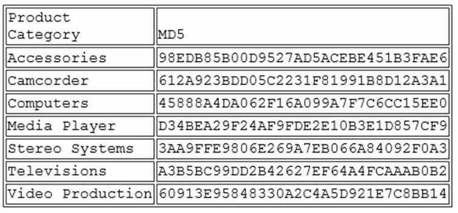
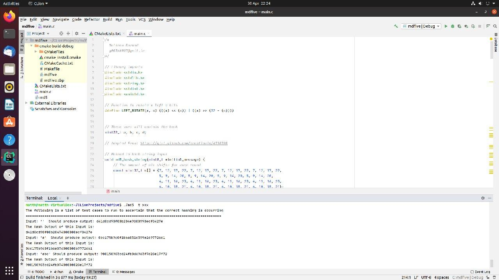
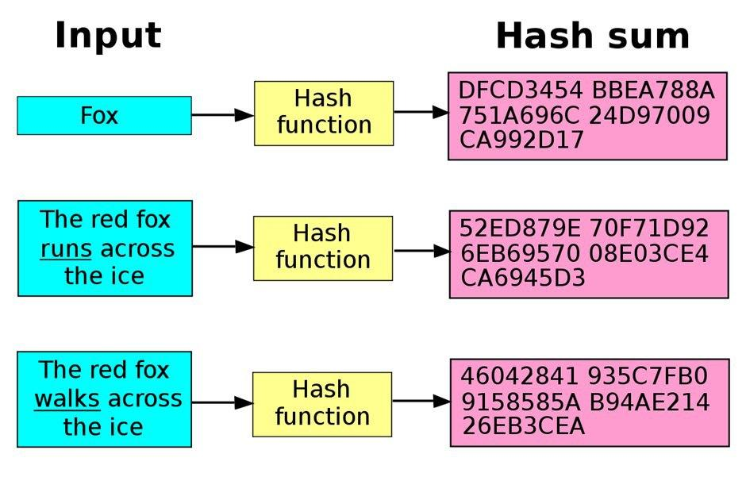
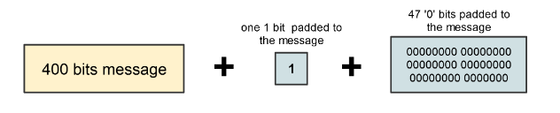
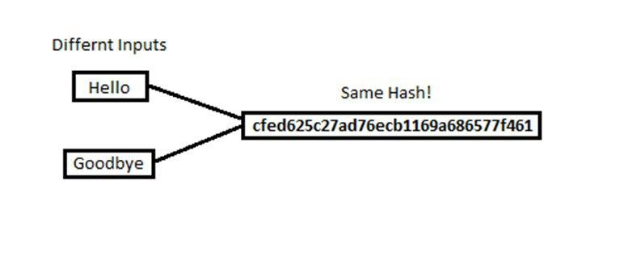
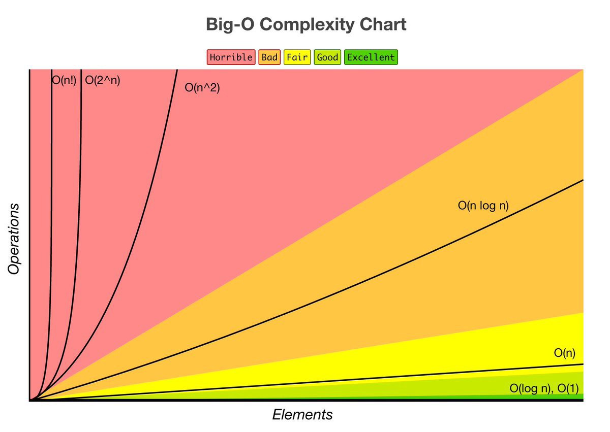

Matthew Durand
G00346987

The following is an overview of my final year Theory of Algorithms project. The project is a program written in C that calculates the MD5 (Message-Digest Algorithm) hash digest of an input. 

# Introduction
The MD5 Hash Algorithm is a cryptographic hash function with a 128-bit hash value. A hash value is the numeric value of a fixed length that uniquely identifies data. Hash values represent large amounts of data as much as smaller numeric values, so they are used with digital signatures. The construction of the MD5 algorithm is outlined in the RFC 1321 document created by the Internet Engineering Task Force. 



MD5 is part of a series of message digest algorithms designed by Professor Ronald Rivest, an Institute Professor in MIT’s Department of Electrical Engineering and Computer Science. Rivest designed MD5 when MD4 was determined to be insecure and needed a more secure replacement.


Ronald Rivest

# Run:
This section is in place to provide instructions on how to clone, compile and run the project code. As well as how to create a linux subsystem on a windows device.

## Setting up environment  
* Open Powershell as Administrator
* Enter the following command in Powershell:
```Enable-WindowsOptionalFeature -Online -FeatureName Microsoft-Windows-Subsystem-Linux```
* Reboot your device.
* Follow [this](https://www.microsoft.com/en-ie/p/ubuntu-2004-lts/9n6svws3rx71?activetab=pivot:overviewtab) link, to get the free Ubuntu subsystem
* Select the "Get" option to be taken to the Microsoft store and install from there
* Complete your setup in the terminal window that opens up
* After the environment has been set up, enter the following command to install a C compiler  
``` sudo apt install gcc ```  
* To confirm that the C compiler has been installed, enter the following command:
``` gcc --version ```

## Clone, Compile, Run
* From the Ubuntu subsystem, enter the following line to clone the repository  
``` Git Clone https://github.com/MattDurand/TheoryOfAlgorithms ```
* From here, change directory to the project by entering the following command  
``` cd cmake-build-debug/ ```
* To compile the project code  
``` gcc -lm -Wall -o md5 main.c ```
* To run the code and to hash an input string, enter the following command:   
``` ./md5 -s "Your string here" ```   
* To run the code and see a set of test cases being run, enter the following command:   
``` ./md5 -t anyArgument ```   
* To list options to be entered, enter the following command:   
``` ./md5 -h anyArgument ```

# Test:
Test cases adapted from the official RFC socument.
The test cases test 4 different inputs "", "a", "abc", "message digest"
  
To run the tests to ascertain whether the hash algorithm is working correctly, enter -t followed by any argument.   
**For example**   
``` ./md5 -t xxx```  
The Output from running these commands should look as follows:  
```
Input: ''  Should produce output: d41d8cd98f00b204e9800998ecf8427e 
The Hash Output of this Input is: 
d41d8cd98f00b20474000000ecf8427e
Input: 'a'  Should produce output: 0cc175b9c0f1b6a831c399e269772661 
The Hash Output of this Input is: 
0cc175b9c0f1b6a87400000069772661
Input: 'abc' Should produce output: 900150983cd24fb0d6963f7d28e17f72 
The Hash Output of this Input is: 
900150983cd24fb07400000028e17f72
Input: 'message digest'  Should produce output: f96b697d7cb7938d525a2f31aaf161d0 
The Hash Output of this Input is: 
f96b697d7cb7938d74000000aaf161d0

```


Tests being run on a Ubuntu machine

# Algorithm:
The MD5 Hash Algorithm is a cryptographic hash function with a 128-bit message digest. A message digest is a cryptographic hash function containing a string of digits created by a one-way hashing formula. It is considered to be a pseudorandom hashing algorithm meaning it is computationally impossible that the MD5 message digest, of different input, can produce two messages of the exact same message digest. Below is a graphic illustrating this:



There are [five steps](https://cs.indstate.edu/~fsagar/doc/paper.pdf) to the MD5 algorithm; Appending Padding Bits, Appending Length, Initialize MD Buffer, Process Message in 16-Word Blocks and finally the Hashed Output.


## Step 1. Append Padding Bits
The  first  step is  to  extend the b-bits message (input)  so  that  the length  of  the  message  is  equal  to  448,  modulo 512. In simpler word themessage should be just 64-bits shy of being a multiple of 512 that is afterpadding the message+64 bit should be divisible by 512. (Message+64)/512 will have reminder 0. No matter the size of the message padding is alwaysdone. First a ’1’ bit is appended to the message and then a series of ’0’ bits.



## Step 2. Append Length  
Now we take the original message and make a 64-bit representation of theoriginal b-bit message. We append this to the result of the previous step.Now the message has a length that is exactly divisible by 512 or the messageis multiple of 512. Which itself is divisible by 16.3
At this point the message is divided into blocks of 512 bits each.  Each512 bits block is divided into 16 words of 32-bits each. We denote the wordsas M[0.....N-1] where N is a multiple of 16.

## Step 3. Initialize MD Buffer  
MD5 uses a four word buffer each 32-bits long. We denote them by A,B,C,D.These are pre-initialized as

```
A: 01 23 45 67 
  
B: 89 ab cd ef
  
C: fe dc ba 98
  
D: 76 54 32 10
```

## Step 4. Process Message in 16-Word Blocks  
We use two other helper functions.  One, we use four auxiliary functions for MD5.  Two, we use a table consisting 64-elements
```
&	bitwise AND
|	bitwise inclusive OR
^	bitwise XOR (exclusive OR)
<<	left shift
>>	right shift
~	bitwise NOT
```
The four auxiliary functions are described in the RFC document as follows:   
```
F(X,Y,Z) = XY v not(X) Z  
X AND Y OR NOT X, AND Z  
  
G(X,Y,Z) = XZ v Y not(Z)  
X AND Z OR Y AND NOT Z  
  
H(X,Y,Z) = X xor Y xor Z  
X XOR Y XOR Z  
  
I(X,Y,Z) = Y xor (X v not(Z))
Y XOR X OR NOT Z
```
  

## Step 5. Output  
After all the operations and all 4 previous steps are done.  The buffer AA,BB, CC, DD contains MD5 digest of our input message.


MD5 uses the Merkle–Damgard construction, so if two prefixes with the same hash can be constructed, a common suffix can be added to both to make the collision more likely to be accepted as valid data by the application using it. Furthermore, current collision-finding techniques allow to specify an arbitrary prefix: an attacker can create two colliding files that both begin with the same content. All the attacker needs to generate two colliding files is a template file with a 128-byte block of data, aligned on a 64-byte boundary that can be changed freely by the collision-finding algorithm. 
As of 2019, one quarter of widely used content management systems were reported to still use MD5 for password hashing.

# Complexity
The MD5 algorithm is an successor to the MD4 algorithm, it was conceived because it was felt that MD4 was being adapted quicker than what critical review of it could be made. While the MD4 was designed to be exceptionally fast in nature, the MD5 was conceived to be slower but to provide more likelihood of increased security[1].  
Although the time complexity of MD5 is a drop-off from that of the MD4 algorithm, it runs at a big O notation of O(n)[3], which is considered a favourable time complexity as this means that the time complexity of the algorithm grows in proportion to the length of the message it has been passed to hash. Although security-wise, both algorithms are now considered to be unsafe, the focus on security over speed by the MD5 algorithm allowed it's security to stay in tact some 10 years longer than that of the MD4 algorithm.
## Collision Attacks

Despite being designed to improve upon the security of MD4, MD5 has it’s own selection of security vulnerabilities.  MD5 is considered reasonably vulnerable to brute force attacks and many tables exist listing the hashed outputs of common passwords. Another significant issue is that many collisions can occur using MD5. A collision occurs when a hash function returns same bucket location for two different keys. A collision will occur when two different inputs have the same hashed output, which can happen because two unequal objects can have the same hashed output.



In cryptography, a collision attack on a cryptographic hash tries to find two inputs producing the same hash value. While it was originally considered infeasible, hashing collision was achieved in 2005. To do this two non-identical files were structured a specific way by the researchers that the mathematical process used in the hashing process was higher than the probability to generate these hash values at random.

# Complexity
The complexity of MD5 is O(n). O(n) means that your algorithm will take on the order of n operations to insert an item. e.g. looping through the list once (or a constant number of times such as twice or only looping through half). Big O notation is used in Computer Science to describe the performance or complexity of an algorithm. Big O specifically describes the worst-case scenario, and can be used to describe the execution time required or the space used by the algorithm. 



# References
[1] [Rivest, R., 1992. RFC1321: The MD5 message-digest algorithm.](https://www.ietf.org/rfc/rfc1321.txt)  
[2] [How to break MD5 and other hash functions](https://link.springer.com/chapter/10.1007/11426639_2)  
[3] [Difference between MD4 and MD5](https://security.stackexchange.com/questions/71709/difference-between-md4-and-md5-encryption)  
[4] [MD5 Hash Tutorial - What the MD5 hash means and how to use it to verify file integrity](https://www.youtube.com/watch?v=33QT7xohUvI&t=)
[5] [Time Complexity of MD5](https://stackoverflow.com/questions/43625569/time-complexity-of-md5)   
[6] [What is MD5 salt?](https://www.md5online.org/blog/md5-salt-hash/)    
[7] [MD4 is not One Way](https://who.rocq.inria.fr/Gaetan.Leurent/files/MD4_FSE08.pdf)
[8] https://docs.microsoft.com/en-us/dotnet/standard/security/ensuring-data-integrity-with-hash-codes
[9] https://gist.github.com/creationix/4710780
[10] https://www.ietf.org/rfc/rfc1321.txt
[11] https://stackoverflow.com/questions/1909307/what-does-on-mean/1909374
[12] https://stackoverflow.com/questions/133008/what-is-big-o-notation-do-you-use-it
[13] [Big O Analysis](https://www.geeksforgeeks.org/analysis-algorithms-big-o-analysis/)
[14] https://cs.indstate.edu/~fsagar/doc/paper.pdf
[15] [Hash Functions and Data Integrity](http://cacr.uwaterloo.ca/hac/about/chap9.pdf)
[16] [Explanation of P vs NP](https://www.claymath.org/sites/default/files/pvsnp.pdf)
[17] Videos provided on [Moodle](https://learnonline.gmit.ie/course/view.php?id=557) by Lecturer, Ian McLoughlin